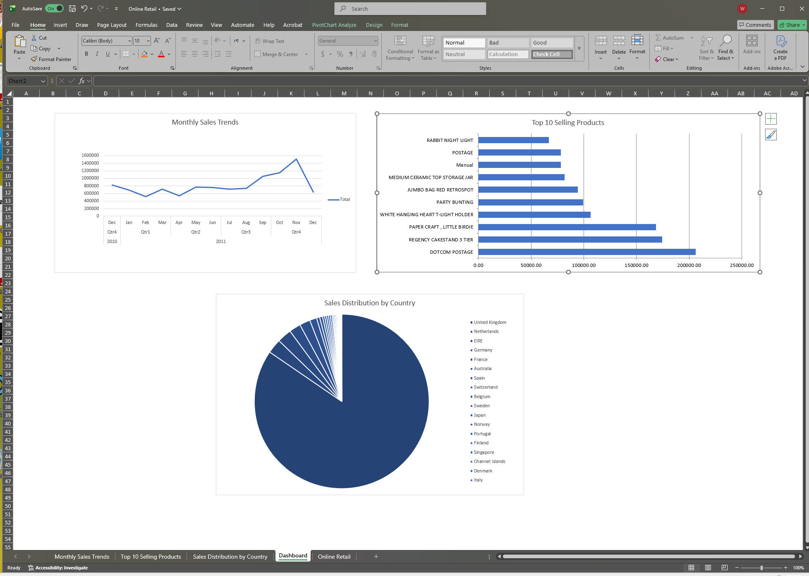

# Online Retail Data Analysis & Interactive Dashboard

## 📌 Project Overview
This project focuses on analyzing a transactional dataset for a UK-based online retail store. The goal was to clean the raw sales data, uncover actionable business insights using Pivot Tables, and build a professional, clean executive dashboard in Microsoft Excel to visualize key performance indicators (KPIs).

## 📊 Key Insights Uncovered
* **Monthly Sales Trends:** Identified historical sales patterns over time, pinpointing key seasonal peaks and shifts in customer purchasing behavior throughout the year.
* **Geographical Dominance:** Uncovered that the **United Kingdom** is the primary market driver, generating the vast majority of total sales revenue (over £9M), followed by secondary international markets like the Netherlands and EIRE.
* **Product Performance:** Isolated the top 10 revenue-generating items, revealing that services like **DOTCOM POSTAGE** and high-demand products like the **REGENCY CAKESTAND 3 TIER** lead the company's sales catalog.

## 🛠️ Data Analysis Techniques Used
* **Data Cleaning & Handling:** Investigated data entry errors and special character encodings (such as descriptive strings with `?` or missing flags) to ensure accurate sales calculations.
* **Advanced Pivot Tables:** Grouped chronological date fields into clean intervals (Months/Years), filtered down item catalogs to look exclusively at the Top 10 performers, and sorted metrics systematically from largest to smallest.
* **Dashboard Design:** Consolidated charts into a dedicated workspace, stripped gridlines for a clean UI presentation, and adjusted chart choices (Line, Horizontal Bar, and Pie charts) for optimal data storytelling with a professional dark blue corporate theme.

## 🖥️ Final Dashboard Preview
*Below is a screenshot of the completed interactive Excel dashboard:*

## 🗂️ Repository Structure
* `Online Retail.xlsx`: The core Excel workbook containing the cleaned source data, Pivot Tables, and the final consolidated dashboard sheet.
* `README.md`: Project documentation and executive summary.
